# ML Framework - Machine Learning Model Training Framework

**A comprehensive, extensible machine learning framework supporting neural networks with PyTorch/TensorFlow backends.**

[](https://opensource.org/licenses/MIT)
[](https://www.python.org/downloads/)

---

## Table of Contents

- [Overview](#overview)
- [Features](#features)
- [System Architecture](#system-architecture)
- [Installation](#installation)
- [Quick Start](#quick-start)
- [Component Breakdown](#component-breakdown)
- [API Reference](#api-reference)
- [Usage Examples](#usage-examples)
- [Configuration System](#configuration-system)
- [Design Patterns](#design-patterns)
- [Best Practices](#best-practices)
- [Contributing](#contributing)
- [License](#license)

---

## Overview

ML Framework is a production-ready machine learning training framework designed for researchers and practitioners who need flexibility, performance, and ease of use. It provides a unified interface for training neural networks while supporting multiple deep learning backends (PyTorch/TensorFlow).

### Key Highlights

- **Framework Agnostic**: Switch between PyTorch and TensorFlow seamlessly
- **Modular Design**: Easy to extend with new models, metrics, or callbacks
- **GPU Acceleration**: Automatic device detection and utilization
- **Mixed Precision Training**: FP16 support for faster training on compatible GPUs
- **Comprehensive Metrics**: Classification and regression evaluation metrics
- **Hyperparameter Tuning**: Grid search, random search, and Bayesian optimization

---

## Features

### Neural Network Architectures

| Architecture | Description | Use Cases |
|-------------|-------------|-----------|
| **CNN** | Convolutional Neural Networks with configurable layers | Image classification, object detection |
| **RNN/LSTM/GRU** | Recurrent networks with bidirectional support | Time series, NLP, sequence modeling |
| **Transformer** | Full Transformer with self-attention mechanisms | NLP, translation, text generation |
| **MLP** | Multi-Layer Perceptrons for tabular data | Baseline models, feature extraction |

### Evaluation Metrics

#### Classification Metrics
- **Accuracy**: Overall correct prediction rate
- **Precision**: True positive rate among predicted positives
- **Recall**: True positive rate among actual positives
- **F1-Score**: Harmonic mean of precision and recall
- **AUC**: Area under ROC curve for binary classification
- **Matthews Correlation Coefficient**: Balanced measure for imbalanced datasets

#### Regression Metrics
- **MSE**: Mean Squared Error
- **MAE**: Mean Absolute Error
- **R² Score**: Coefficient of determination

### Hyperparameter Optimization

| Method | Description | Best For |
|--------|-------------|----------|
| **Grid Search** | Exhaustive search over parameter combinations | Small parameter spaces |
| **Random Search** | Random sampling from distributions | Large parameter spaces |
| **Bayesian Optimization** | Gaussian process-based optimization | Expensive evaluations |

### Training Callbacks

- **EarlyStopping**: Prevents overfitting by stopping when validation metric stops improving
- **LearningRateScheduler**: Dynamic learning rate adjustment with warmup and decay schedules
- **ModelCheckpoint**: Saves best models during training
- **TensorBoardCallback**: Logs metrics for visualization

---

## System Architecture

```mermaid
graph TB
    subgraph "User Interface"
        A[TrainingConfig] --> B[Framework API]
        C[Example Scripts] --> B
    end
    
    subgraph "Core Engine"
        B --> D[TrainerEngine]
        D --> E[CallbackManager]
        E --> F[EarlyStopping]
        E --> G[LRScheduler]
        E --> H[ModelCheckpoint]
    end
    
    subgraph "Backend Abstraction"
        D --> I[BackendAdapter]
        I --> J[PyTorchBackend]
        I --> K[TensorFlowBackend]
        J --> L[CUDA/GPU Support]
        J --> M[Mixed Precision AMP]
        K --> N[XLA Optimization]
    end
    
    subgraph "Model Definitions"
        D --> O[ModelFactory]
        O --> P[CNN]
        O --> Q[RNN/LSTM/GRU]
        O --> R[Transformer]
        O --> S[MLP]
    end
    
    subgraph "Evaluation"
        D --> T[Evaluator]
        T --> U[Classification Metrics]
        T --> V[Regression Metrics]
        U --> W[Accuracy/Precision/Recall/F1]
        V --> X[MSE/MAE/R²]
    end
    
    subgraph "Hyperparameter Tuning"
        D --> Y[TunerEngine]
        Y --> Z[GridSearch]
        Y --> AA[RandomSearch]
        Y --> AB[BayesianOptimization]
    end
    
    subgraph "Persistence"
        D --> AC[CheckpointManager]
        AC --> AD[Save/Load Checkpoints]
        AC --> AE[Model Serialization]
        AE --> AF[PyTorch/.pt]
        AE --> AG[TensorFlow/SavedModel]
        AE --> AH[ONNX Export]
    end
    
    subgraph "Configuration"
        B --> AI[ConfigManager]
        AI --> AJ[TrainingConfig]
        AI --> AK[ModelConfig]
        AI --> AL[BackendConfig]
    end
```



---

## Installation

### Requirements

- Python 3.8 or higher
- NumPy >= 1.20.0
- SciPy >= 1.7.0
- scikit-learn >= 0.24.0

### Install with PyTorch Backend (Recommended)

```bash
pip install torch numpy scipy scikit-learn
cd ml_framework
pip install -e .
```

### Install with TensorFlow Backend (Alternative)

```bash
pip install tensorflow numpy scipy scikit-learn
cd ml_framework
pip install -e .
```

### Optional Dependencies

```bash
# For TensorBoard visualization
pip install tensorboard

# For ONNX export support
pip install onnx
```

---

## Quick Start

### Basic Training Example

```python
from ml_framework import Trainer, PyTorchBackend, MLP, MLPConfig, Accuracy

# Create model configuration
config = MLPConfig(
    input_dim=784,      # e.g., 28x28 flattened MNIST images
    hidden_dims=[256, 128],
    output_dim=10,      # 10 classes for MNIST
    dropout=0.3
)

# Initialize model and backend
model = MLP(config)
backend = PyTorchBackend(device="auto")

# Create optimizer and loss function
optimizer = backend.create_optimizer(model=model, lr=0.001)
loss_fn = backend.create_loss_fn(loss_type="cross_entropy")

# Set up trainer with metrics
metrics = [Accuracy()]
trainer = Trainer(
    model=model, 
    backend=backend, 
    optimizer=optimizer, 
    loss_fn=loss_fn, 
    metrics=metrics
)

# Train the model
history = trainer.fit(
    X_train=X_train,
    y_train=y_train,
    epochs=100,
    batch_size=32,
    validation_data=(X_val, y_val),
    verbose=1
)
```

### Training with Callbacks

```python
from ml_framework import EarlyStopping, ModelCheckpoint, LearningRateScheduler

# Configure callbacks
early_stopping = EarlyStopping(
    monitor="val_loss",
    patience=10,
    min_delta=0.001,
    restore_best_weights=True
)

model_checkpoint = ModelCheckpoint(
    filepath="checkpoints/best_model_{epoch}_{val_accuracy:.2f}.pt",
    monitor="val_accuracy",
    save_best_only=True,
    verbose=1
)

lr_scheduler = LearningRateScheduler(
    initial_lr=0.001,
    min_lr=1e-6,
    warmup_epochs=5,
    max_epochs=100
)

# Train with callbacks
history = trainer.fit(
    X_train=X_train,
    y_train=y_train,
    epochs=100,
    batch_size=32,
    validation_data=(X_val, y_val),
    callbacks=[early_stopping, model_checkpoint, lr_scheduler]
)
```

---

## Component Breakdown

### 1. Core Engine (`core/`)

#### TrainerEngine
The main training orchestration class responsible for:
- Managing epoch iteration and batch processing
- Coordinating callbacks at each training stage
- Collecting metrics and computing statistics
- Handling device placement (CPU/GPU/CUDA)
- Supporting mixed precision training

**Key Methods:**
```python
trainer.fit(X_train, y_train, epochs=100, batch_size=32, ...)
trainer.evaluate(X_test, y_test, batch_size=32)
trainer.predict(X_data, batch_size=32)
trainer.get_history()  # Returns training history dictionary
```

#### CallbackManager
Event-driven callback system that:
- Supports custom callback registration
- Calls callbacks at predefined training stages
- Manages callback execution order
- Provides context information to callbacks

**Callback Lifecycle:**
1. `on_train_begin()` - Called before training starts
2. `on_epoch_begin(epoch)` - Called at start of each epoch
3. `on_batch_begin(batch)` - Called at start of each batch
4. `on_batch_end(batch, logs)` - Called after each batch
5. `on_epoch_end(epoch, logs)` - Called after each epoch
6. `on_train_end(logs)` - Called after training completes

### 2. Backend Abstraction (`backends/`)

#### BackendAdapter
Abstract base class defining the interface for all backend implementations:
- Unified API for model operations across frameworks
- Device management and tensor operations
- Optimizer and loss function creation
- Data loader integration

#### PyTorchBackend
Full PyTorch integration featuring:
- Native PyTorch tensor operations
- Autograd support for automatic differentiation
- GPU acceleration via CUDA
- Mixed Precision Training (AMP) with GradScaler
- Support for all PyTorch optimizers and loss functions

**Supported Optimizers:** Adam, SGD, RMSprop, Adagrad, AdamW

#### TensorFlowBackend
TensorFlow 2.x/Keras integration featuring:
- Keras API compatibility
- XLA optimization support
- Automatic mixed precision (float16)
- tf.data pipeline for efficient data loading

### 3. Model Definitions (`models/`)

#### CNN (Convolutional Neural Network)
Configurable architecture with:
- Multiple convolution blocks with increasing filter counts
- Configurable kernel sizes and pooling operations
- Batch normalization for faster convergence
- Dropout regularization
- ResNet-style skip connections option

**Configuration:**
```python
config = CNNConfig(
    input_shape=(32, 32, 3),   # CIFAR-10 images
    num_classes=10,
    num_filters=[32, 64, 128],
    kernel_sizes=[3, 3, 3],
    pool_sizes=[2, 2, 2],
    dropout_rates=[0.5, 0.5, 0.5],
    use_batch_norm=True,
    use_skip_connections=False
)
```

#### RNN/LSTM/GRU
Recurrent architectures with:
- LSTM and GRU cell variants
- Bidirectional support for context from both directions
- Multi-layer stacking
- Dropout on recurrent connections
- Sequence-to-label and sequence-to-sequence modes

**Configuration:**
```python
config = RNNConfig(
    input_dim=128,              # Feature dimension per timestep
    hidden_dims=[64, 128],      # Hidden layer sizes
    num_classes=10,
    dropout=0.3,
    recurrent_dropout=0.2,
    use_bidirectional=True,
    return_sequences=False
)
```

#### Transformer
Full Transformer implementation with:
- Multi-head self-attention mechanism
- Positional encoding for sequence order
- Feed-forward networks per layer
- Layer normalization and residual connections
- Encoder-only (BERT-style), decoder-only (GPT-style), or encoder-decoder modes

**Configuration:**
```python
config = TransformerConfig(
    input_dim=512,              # Input embedding dimension
    d_model=256,                # Model dimension
    num_heads=8,                # Number of attention heads
    num_encoder_layers=4,       # Encoder layers
    num_decoder_layers=4,       # Decoder layers (if encoder-decoder)
    d_ff=1024,                  # Feed-forward dimension
    dropout=0.1,
    max_seq_len=512,
    num_classes=10,
    is_decoder_only=False       # Use encoder-only for classification
)
```

#### MLP (Multi-Layer Perceptron)
Classic fully-connected network with:
- Configurable hidden layer sizes
- Multiple activation functions (ReLU, LeakyReLU, Tanh, GELU, etc.)
- Batch normalization support
- Dropout regularization

### 4. Evaluation (`evaluation/`)

#### Metrics Module
Comprehensive metric implementations:
- **Accuracy**: `Accuracy()` - Overall correct prediction rate
- **Precision**: `Precision(average="macro")` - Per-class or average precision
- **Recall**: `Recall(average="macro")` - Per-class or average recall
- **F1-Score**: `F1Score(average="macro")` - Harmonic mean of precision/recall
- **MSE**: `MeanSquaredError()` - Mean squared error for regression
- **MAE**: `MeanAbsoluteError()` - Mean absolute error
- **R² Score**: `R2Score()` - Coefficient of determination
- **AUC**: `AUC()` - Area under ROC curve

#### Evaluator Class
Unified evaluation interface:
```python
evaluator = Evaluator(metrics=[Accuracy(), F1Score()])
results = evaluator.evaluate(predictions, targets)
report = evaluator.get_report(results)
print(report)
```

### 5. Hyperparameter Tuning (`tuning/`)

#### GridSearch
Exhaustive parameter grid search:
```python
param_grid = {
    "learning_rate": [0.001, 0.01],
    "dropout": [0.3, 0.5],
    "batch_size": [32, 64]
}

search = GridSearch(param_grid=param_grid, cv=5)
search.fit(model, X_train, y_train, X_val=X_val, y_val=y_val)

print(f"Best parameters: {search.best_params}")
print(f"Best score: {search.best_score:.4f}")
```

#### RandomSearch
Random sampling from parameter distributions:
```python
from ml_framework import log_uniform

param_distributions = {
    "learning_rate": log_uniform(0.0001, 0.1),
    "dropout": [0.3, 0.5, 0.7],
}

search = RandomSearch(param_distributions=param_distributions, n_iter=20)
search.fit(model, X_train, y_train)
```

#### BayesianOptimization
Gaussian process-based optimization:
```python
param_bounds = {
    "learning_rate": (1e-5, 1e-1),
    "dropout": (0.0, 0.7),
}

optimizer = BayesianOptimization(param_bounds=param_bounds, n_iter=30)
optimizer.fit(model, X_train, y_train)
```

### 6. Persistence (`persistence/`)

#### CheckpointManager
Manages model checkpoints during training:
```python
checkpoint_manager = CheckpointManager(
    save_dir="checkpoints",
    monitor="val_loss",
    save_best_only=True,
    keep_last_n=3
)

# Save checkpoint
filepath = checkpoint_manager.save_checkpoint(
    model=model,
    epoch=current_epoch,
    metrics=train_metrics,
    optimizer=optimizer
)

# Load checkpoint
start_epoch, metrics = checkpoint_manager.load_checkpoint(model, optimizer)
```

#### ModelSerializer
Export models to various formats:
```python
# Save PyTorch model
ModelSerializer.save_pytorch(model, "model.pt")

# Export to ONNX
ModelSerializer.save_onnx(model, input_shape=(1, 32, 32), output_path="model.onnx")

# Export all formats
paths = ModelSerializer.export_all(
    model=model,
    model_class=MLP,
    input_shape=(784,),
    output_dir="exports/"
)
```

---

## API Reference

### Core Classes

#### Trainer
```python
class Trainer:
    def __init__(self, model, backend, optimizer=None, loss_fn=None, metrics=[], callbacks=[])
    
    def fit(X_train, y_train, epochs=100, batch_size=32, validation_data=None, shuffle=True, verbose=1) -> Dict
    
    def evaluate(X_test, y_test, batch_size=32, verbose=1) -> Dict
    
    def predict(X, batch_size=32) -> np.ndarray
    
    def get_history() -> Dict[str, List]
```

#### Callbacks

**EarlyStopping**
```python
EarlyStopping(
    monitor="val_loss",      # Metric to monitor
    patience=10,             # Epochs without improvement before stopping
    min_delta=0.001,         # Minimum change to qualify as improvement
    restore_best_weights=True
)
```

**LearningRateScheduler**
```python
LearningRateScheduler(
    initial_lr=0.001,        # Starting learning rate
    min_lr=1e-6,             # Minimum learning rate
    warmup_epochs=5,         # Warmup period
    max_epochs=100           # Total epochs (for cosine decay)
)
```

**ModelCheckpoint**
```python
ModelCheckpoint(
    filepath="checkpoint_{epoch}_{val_loss:.2f}.pt",  # Path with placeholders
    monitor="val_accuracy",                           # Metric to track
    save_best_only=True,                              # Only save best model
    verbose=1                                         # Print messages
)
```

### Model Configurations

| Class | Parameters | Description |
|-------|------------|-------------|
| `MLPConfig` | input_dim, hidden_dims, output_dim, activation, dropout, batch_norm | MLP architecture config |
| `CNNConfig` | input_shape, num_classes, num_filters, kernel_sizes, pool_sizes, use_skip_connections | CNN architecture config |
| `RNNConfig` | input_dim, hidden_dims, num_classes, rnn_type, use_bidirectional, return_sequences | RNN/LSTM/GRU config |
| `TransformerConfig` | d_model, num_heads, num_encoder_layers, num_decoder_layers, d_ff, is_decoder_only | Transformer config |

---

## Usage Examples

### CNN for Image Classification

```python
from ml_framework import (
    Trainer, PyTorchBackend, CNN, CNNConfig,
    Accuracy, Precision, Recall, F1Score, EarlyStopping
)

config = CNNConfig(
    input_shape=(32, 32, 3),
    num_classes=10,
    num_filters=[32, 64, 128],
    use_batch_norm=True
)

model = CNN(config)
backend = PyTorchBackend(device="cuda")
optimizer = backend.create_optimizer(model=model, lr=0.001)

trainer = Trainer(model, backend, optimizer=optimizer, metrics=[Accuracy()])

history = trainer.fit(
    X_train=X_train, y_train=y_train,
    epochs=100, batch_size=32,
    validation_data=(X_val, y_val),
    callbacks=[EarlyStopping(monitor="val_loss", patience=15)]
)
```

### Transformer for Sequence Classification

```python
from ml_framework import Transformer, TransformerConfig

config = TransformerConfig(
    input_dim=512,
    d_model=256,
    num_heads=8,
    num_encoder_layers=4,
    num_classes=10,
    is_decoder_only=False
)

model = Transformer(config)
```

### Hyperparameter Tuning with Cross-Validation

```python
from ml_framework import GridSearch

param_grid = {
    "learning_rate": [0.001, 0.01],
    "dropout": [0.3, 0.5]
}

search = GridSearch(param_grid=param_grid, cv=5)
results = search.cross_validate(model, X_train, y_train)

print(f"Best params: {search.best_params}")
```

---

## Configuration System

### Using Config Classes

```python
from ml_framework import TrainingConfig, ModelConfig, BackendConfig

# Create training configuration
train_config = TrainingConfig(
    epochs=100,
    batch_size=32,
    learning_rate=0.001,
    device="cuda"
)

# Create model configuration
model_config = ModelConfig(
    model_type="cnn",
    input_shape=(32, 32, 3),
    num_classes=10
)

# Load from file
config = Config.load("config.json")

# Save to file
train_config.save("training_config.json")
```

### Configuration File Format (JSON)

```json
{
    "training": {
        "epochs": 100,
        "batch_size": 32,
        "learning_rate": 0.001,
        "device": "auto",
        "early_stopping_patience": 10
    },
    "model": {
        "model_type": "cnn",
        "input_shape": [32, 32, 3],
        "num_classes": 10,
        "num_filters": [32, 64, 128]
    },
    "backend": {
        "framework": "pytorch",
        "mixed_precision": false
    }
}
```

---

## Design Patterns

The framework employs several design patterns for flexibility and maintainability:

| Pattern | Usage |
|---------|-------|
| **Strategy** | Backend abstraction allows swapping PyTorch/TensorFlow |
| **Observer** | Callback system for event-driven training |
| **Factory** | Model factory for creating different architectures |
| **Template Method** | Training loop template with customization hooks |

---

## Best Practices

### For Best Results

1. **Learning Rate Scheduling**: Use warmup followed by cosine decay for Transformers
2. **Early Stopping**: Set patience based on training duration (5-20 epochs)
3. **Batch Normalization**: Enable for CNNs and deep MLPs to speed up convergence
4. **Dropout**: Use 0.3-0.5 for regularization in smaller models
5. **Mixed Precision**: Enable for faster training on GPUs with FP16 support

### Common Pitfalls to Avoid

1. Don't use too high learning rates with Transformers (start with 1e-4)
2. Ensure validation data is not shuffled during evaluation
3. Use appropriate batch sizes based on GPU memory
4. Monitor both training and validation metrics for overfitting detection

---

## Contributing

Contributions are welcome! Please feel free to submit issues or pull requests.

### Development Setup

```bash
git clone https://github.com/yourusername/ml-framework.git
cd ml-framework
pip install -e ".[dev]"
```

### Running Tests

```bash
pytest tests/ -v
```

---

## License

This project is licensed under the MIT License - see the [LICENSE](LICENSE) file for details.

---

*Note: This architecture document describes version 1.0.0 of ML Framework.*
